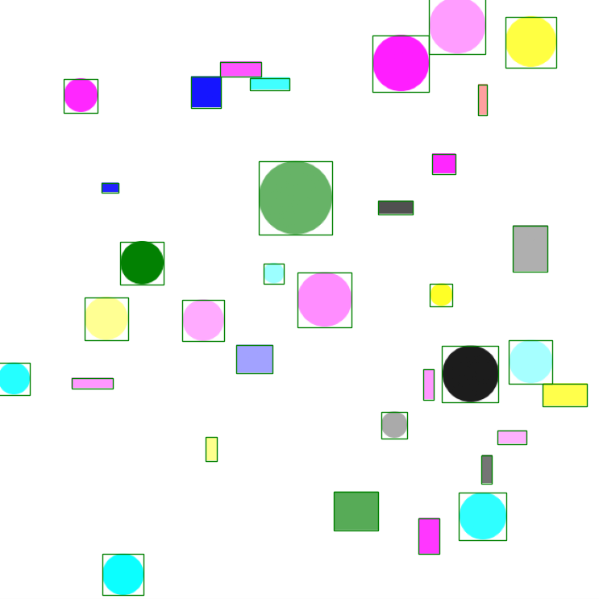

# Teste Anotação Detecção de Objectos



Este repositório foi criado com propósito de criar diversos testes de qualidade de anotação para modelos de detecção de objetos para identificar as consequências nos resultados com diversos tipos diferentes de problemas que podem e ocorrem durante as anotações de datasets.


Para o desenvolvimento do dataset foi utilizado o repositório [shapes](https://github.com/ProgramadorArtificial/shapes/tree/master) para criar o dataset, posteriormente utilizado códigos desenvolvidos neste repositório para ajustá-lo conforme a necessidade e realizar os treinamentos e análise dos resultados.


Neste projeto foi utilizado principalmente a biblioteca Ultralytics para realizar o treinamento e inferências utilizando a arquitetura do YOLOv8 e a ferramenta de análise de dados FiftyOne para analisar os resultados dos modelos treinados utilizando diversas qualidades de anotações.


[Vídeo explicando o experimento e os resultados](https://youtu.be/BEJcHYciIjo)

Todos resultados obtidos estão no arquivo "all_results.csv" e algumas das conclusões tiradas neste projeto estão dentro do Jupyter Notebook "results_analyzer", assim como no vídeo mencionado acima.

**OBS:** Algumas pastas possuem links para outros repositórios, então recomenda-se clonar este repositório utilizando o parâmetro “--recurse-submodules”:

```
git clone --recurse-submodules git@github.com:ProgramadorArtificial/teste_anotacao_detectacao_objeto.git
```

## Pré-requisitos
Caso deseje utilizar o Anaconda, disponibilizei meu environment chamado "yolov8" e pode ser instalado usando o comando:


```
conda env create -f yolov8.yml
```


## Como rodar
1. É necessário criar o dataset utilizando o repositório [shapes](https://github.com/ProgramadorArtificial/shapes/tree/master). Recomenda-se manter as configurações de nomes das pastas padrões ("tmp/dataset") para evitar novas alterações;
2. Com dataset criado, mova a pasta "tmp" com os dados para a raiz deste repositório;
3. Como o dataset é criado com anotações em um formato diferente do aceito pelo YOLOv8 que é utilizado neste repositório, é necessário converter utilizando o script "1-convert_to_yolo_format.py" que também irá criar diversos tipos de erros de anotação, salvando-as em "tmp/dataset/yolo". Por padrão, irá salvar apenas as anotações para não multiplicar as imagens diversas vezes, ou seja, as imagens ficarão apenas na pasta principal (já existente, criada anteriormente);
  - Opcional: Caso queira criar novos tipos de erros de anotação pode alterar logo no início do script o dicionário chamado "datasets_to_create", onde cada chave do dicionário consiste em uma variação do dataset original, podendo criar com maiores ou menores taxas de erros.
4. Com o dataset pronto, pode ser editado o script "2-train_yolo.py" informando o caminho para pasta "yolo" (onde estão as anotações das diversas versões do dataset) e "images" (onde estão armazenadas as imagens), se desejar pode alterar as configurações de treinamento na função "train_yolo". Por fim, pode ser executado o script para iniciar o treinamento. Será treinado um modelo individual para cada pasta de datasets, armazenando os checkpoints e resultados nas respectivas pastas;
  - Opcional: Caso tenha parado o treinamento no caminho, pode alterar a variável "is_continue" para True e dentro do loop informar o nome da pasta principal e da subpasta que realizou o último treinamento, desta forma irá começar a partir da próxima pasta.
5. Com treinamento pronto, pode ser editado o script "3-evaluate.py" para informar os dados que deseja utilizar para fazer as avaliações dos dados. Por padrão, recomenda-se utilizar o dataset "official" (anotações corretas) com todos os dados e utilizar o dataset de "test" por não participar do treinamento. Ao terminar a execução será criar um arquivo chamado "all_results.csv" contendo todos os resultados;
  - Opcional: Dentro do script "3-evaluate.py" pode ser alterado a variável "is_save_fiftyone" para salvar as sessões com as inferências em um arquivo JSON. Ressaltando que é um processamento demorado e irá aumentar consideravelmente o tempo para finalizar, assim como ocupar um espaço considerável em disco para armazenar os JSONs. Recomenda-se rodar os casos isolados que deseja visualizar dentro do Fiftyone. Inclusive dentro do Jupyter Notebook que será mencionado na próxima etapa possui código pronto para realizar esta tarefa.
6. Com tudo pronto, pode ser acessado o Jupyter Notebook "results_analyzer" onde irá ter todas as análises realizadas neste projeto, mas que pode servir como inspiração para criar as suas próprias análises.


## Autor
* **Programador Artificial** - [GitHub](https://github.com/ProgramadorArtificial) - [YouTube](https://www.youtube.com/@ProgramadorArtificial)

